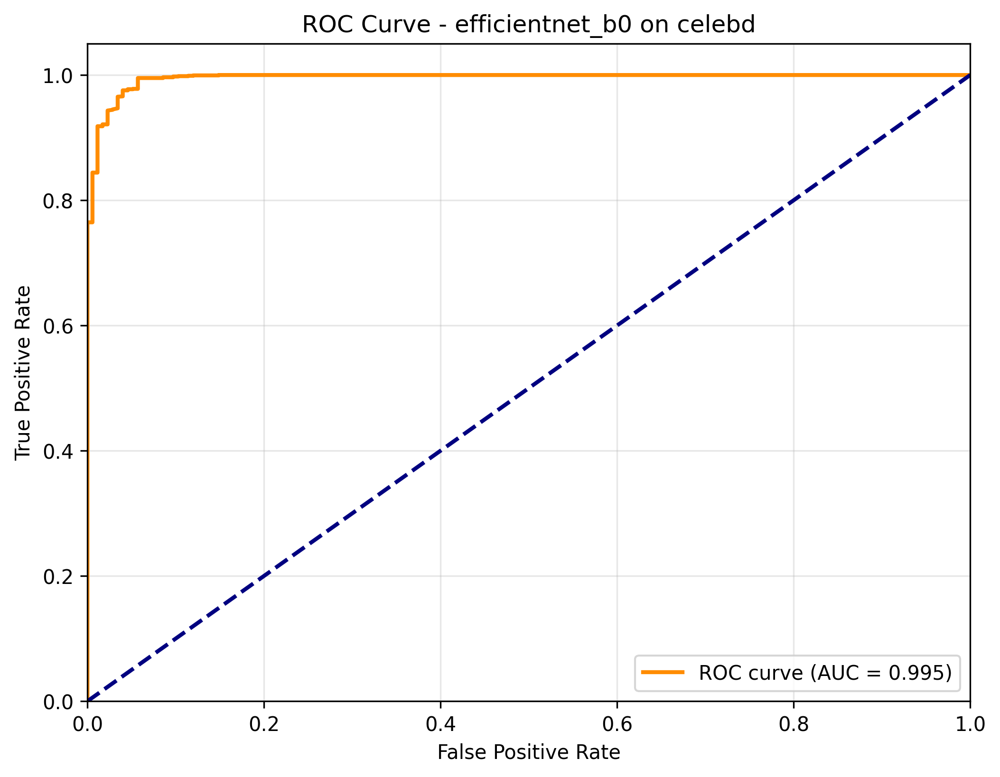
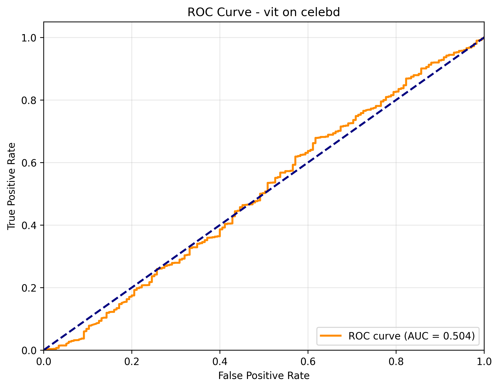
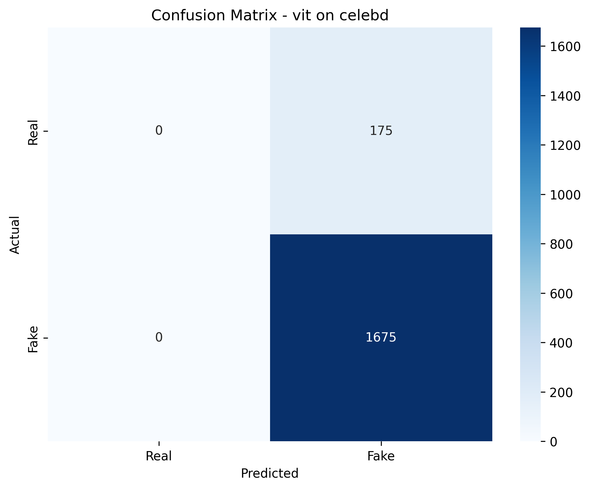
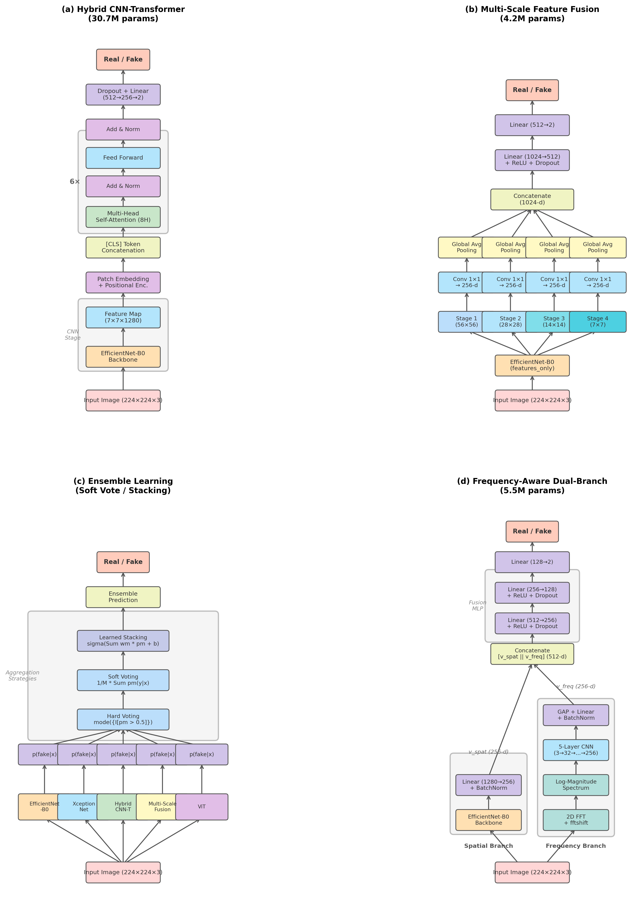
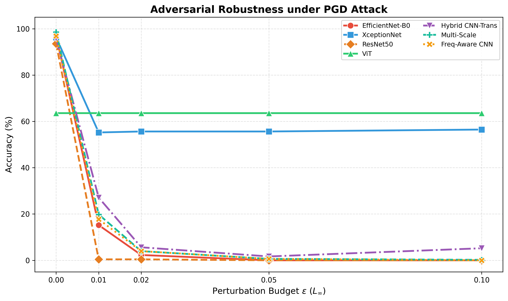
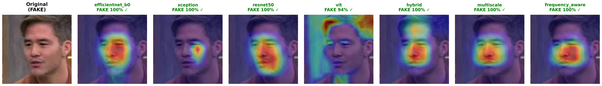
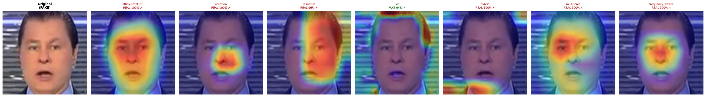

# 🔍 Deepfake Detection Research

> **Two published research papers** on deepfake detection — from comparative benchmarking to novel architectures and adversarial robustness evaluation across 7 deep learning models.

---

## 📌 Overview

This repository contains the complete codebase, training pipelines, evaluation frameworks, and research papers for a two-phase deepfake detection study:

1. **Paper 1 — Comparative Study**: Benchmarking four architectures (EfficientNet-B0, XceptionNet, ResNet50, ViT) on Celeb-DF and FaceForensics++ to identify the generalization gap.
2. **Paper 2 — Bridging the Gap**: Designing three novel architectures and evaluating ensemble strategies + adversarial robustness across all 7 models.

---

## 📂 Repository Structure

```
Deepfake/
├── papers/                          # Research papers & LaTeX assets
│   ├── comparative_study/           # Paper 1: CNN vs. Transformer comparison
│   │   ├── SpringConference.tex
│   │   └── figures/                 # Confusion matrices, ROC/PR curves, Grad-CAM
│   │
│   └── bridging_the_gap/            # Paper 2: Novel architectures & adversarial eval
│       ├── NewProject.tex
│       └── figures/                 # Architecture diagrams, adversarial plots, Grad-CAM grids
│
├── docs/                            # Documentation organized by project
│   ├── comparative_study/           # Docs specific to Paper 1
│   ├── bridging_the_gap/            # Docs specific to Paper 2
│   └── shared/                      # Setup guides, architecture docs
│
├── src/                             # Core source code
│   ├── data/                        # Data loading & face preprocessing
│   ├── training/                    # Training loop with mixed-precision & early stopping
│   ├── evaluation/                  # Metrics, adversarial attacks (FGSM, PGD)
│   ├── explainability/              # Grad-CAM visualization engine
│   ├── reporting/                   # LaTeX-ready report generation
│   └── utils/                       # Configuration & utility functions
│
├── tools/                           # Utility scripts (diagram/plot generators)
├── scripts/                         # Shell scripts for pipeline automation
├── configs/                         # Training configuration (YAML)
├── notebooks/                       # Jupyter notebooks for experimentation
├── figures/                         # Generated evaluation figures
├── main.py                          # Main pipeline entry point
└── requirements.txt                 # Python dependencies
```

---

## 📄 Paper 1: Comparative Study

**"Deepfake Detection on Facial Features Using Deep Learning: A Comparative Study of CNN and Transformer Architectures"**

> 📁 [`papers/comparative_study/SpringConference.tex`](papers/comparative_study/SpringConference.tex)

### Research Focus

This paper establishes baseline detection performance by systematically comparing four architectures trained on **Celeb-DF (v2)** (18,472 images) and cross-evaluated on **FaceForensics++** (20,781 frames):

| Architecture | Type | Parameters | Key Strengths |
|---|---|:---:|---|
| **EfficientNet-B0** | CNN | 5.3M | Compound-scaled, efficient feature extraction |
| **XceptionNet** | CNN | 38.9M | Depthwise separable convolutions for fine texture |
| **ResNet50** | CNN | 25.6M | Residual connections for deep learning stability |
| **Vision Transformer (ViT)** | Transformer | 86.6M | Global self-attention over patch sequences |

### Key Results

| Model | Celeb-DF Accuracy | Celeb-DF AUC | FF++ Accuracy | FF++ AUC |
|---|:---:|:---:|:---:|:---:|
| EfficientNet-B0 | **98.70%** | **99.54%** | 49.66% | 73.43% |
| XceptionNet | 98.76% | 98.57% | 56.33% | 68.71% |
| ResNet50 | 98.22% | 99.50% | 56.11% | 72.98% |
| Vision Transformer | 90.54% | 50.35% | **66.06%** | 52.75% |

<p align="center">
  
  
</p>
<p align="center"><em>ROC Curves — EfficientNet-B0 (AUC 0.995) vs. Vision Transformer (AUC 0.504) on Celeb-DF</em></p>

### Critical Finding: The Generalization Gap

All CNNs achieved **98%+ accuracy** on Celeb-DF but **collapsed to ~50%** on FaceForensics++ — exposing that models overfit to dataset-specific generation fingerprints rather than learning universal manipulation artifacts. The ViT showed the smallest drop (-24.48%), suggesting self-attention captures more transferable features.

### Model Interpretability (Grad-CAM)

Grad-CAM heatmaps reveal what each model "looks at" when classifying faces:

<p align="center">
  
  
  
</p>
<p align="center"><em>Confusion Matrices — Near-perfect CNN classification vs. ViT's systematic false-positive bias</em></p>

---

## 📄 Paper 2: Bridging the Generalization Gap

**"Bridging the Generalization Gap in Deepfake Detection: Ensemble and Hybrid Strategies for Cross-Domain Robustness"**

> 📁 [`papers/bridging_the_gap/NewProject.tex`](papers/bridging_the_gap/NewProject.tex)

### Research Focus

Building on Paper 1's findings, this study introduces **three novel architectures** and conducts the most comprehensive ensemble + adversarial evaluation in deepfake detection literature.

### Novel Architecture Designs

<p align="center">
  
</p>
<p align="center"><em>Four detection paradigms: (a) Hybrid CNN-Transformer, (b) Multi-Scale Feature Fusion, (c) Ensemble Learning, (d) Frequency-Aware Dual-Branch</em></p>

| Novel Architecture | Parameters | Approach | Celeb-DF AUC |
|---|:---:|---|:---:|
| **Hybrid CNN-Transformer** | 30.7M | EfficientNet backbone + 6-layer Transformer encoder with 8-head self-attention | 99.67% |
| **Multi-Scale Feature Fusion** | **4.2M** | 4-stage EfficientNet feature aggregation with 1×1 projection + GAP | 99.63% |
| **Frequency-Aware Dual-Branch** | 5.5M | Parallel spatial (EfficientNet) + frequency (2D-FFT + 5-layer CNN) branches with late fusion | **99.84%** |

> 💡 The Multi-Scale model achieves state-of-art performance with only **4.2M parameters** — 9× smaller than XceptionNet and 20× smaller than ViT.

### Ensemble Ablation Study

Six model combinations × three aggregation strategies (Hard Voting, Soft Voting, Learned Stacking):

| Ensemble Configuration | Models | Celeb-DF Acc. | FF++ Acc. |
|---|---|:---:|:---:|
| CNN-Only | Eff, Xce, Res | 99.24% | 54.75% |
| CNN+ViT | Eff, Xce, Res, ViT | 99.19% | **56.56%** |
| Full 6-Model | All 6 | 99.41% | 55.77% |
| **All-Best (5M)** | **Eff, Xce, Hyb, MS, ViT** | **99.51%** | 55.43% |

### ⚔️ Adversarial Robustness: The Critical Security Test

White-box attacks (FGSM & PGD) at perturbation budgets ε ∈ {0.01, 0.02, 0.05, 0.10} reveal three distinct robustness tiers:

<p align="center">
  
</p>
<p align="center"><em>Accuracy under PGD attack — CNNs collapse while ViT maintains complete invariance at 63.54%</em></p>

| Robustness Tier | Models | PGD (ε=0.05) | Behavior |
|---|---|:---:|---|
| 🔴 **Complete Collapse** | EfficientNet, ResNet50, Freq-Aware | **0.00%** | Operationally useless against adversaries |
| 🟡 **Structural Resilience** | XceptionNet | **55.63%** | Depthwise separable convolutions resist gradient attacks |
| 🟢 **Complete Invariance** | Vision Transformer | **63.54%** | Self-attention provides gradient masking immunity |

> ⚠️ **Key Insight**: The highest-accuracy model (EfficientNet at 98.70%) is the *worst* adversarial choice, while the lowest (ViT at 90.54%) is the *most stable*. This inverts conventional deployment logic.

### 🔬 Grad-CAM Failure Analysis

Grad-CAM heatmaps across all 7 models on the same face reveal distinct attention patterns:

<p align="center">
  
</p>
<p align="center"><em>All 7 models correctly identify a Celeb-DF fake — CNN models focus on facial boundaries while ViT shows broader attention</em></p>

<p align="center">
  
</p>
<p align="center"><em>⚡ A FaceForensics++ fake that evaded 6/7 models — only ViT correctly detected it, validating its cross-dataset superiority</em></p>

---

## 🚀 Quick Start

```bash
# 1. Create virtual environment
python -m venv .venv && source .venv/bin/activate

# 2. Install dependencies
pip install -r requirements.txt

# 3. Run the main pipeline
python main.py
```

For detailed setup and training instructions, see:
- [Quick Start Guide](docs/shared/QUICKSTART.md)
- [Training on Celeb-DF](docs/shared/TRAIN_CELEBDF.md)
- [Full Architecture Guide](docs/shared/PROJECT_ARCHITECTURE_GUIDE.md)

---

## 🛠 Tech Stack

- **Framework**: PyTorch 2.x with MPS/CUDA acceleration
- **Models**: EfficientNet-B0, XceptionNet, ResNet50, ViT (timm), 3 custom architectures
- **Training**: AdamW optimizer, Cosine Annealing LR, Binary Cross-Entropy, mixed-precision
- **Attacks**: FGSM (single-step), PGD (10-step iterative)
- **Interpretability**: Grad-CAM with per-model heatmap generation
- **Datasets**: Celeb-DF v2, FaceForensics++

---

## 📊 Summary of Contributions

1. **7 architectures** benchmarked — 4 baselines + 3 novel designs
2. **18 ensemble configurations** evaluated (6 combinations × 3 strategies)
3. **New performance ceiling**: 99.51% accuracy (Soft-Vote), 99.84% AUC (Frequency-Aware)
4. **First comprehensive adversarial evaluation** in deepfake detection across 7 models at 5 perturbation budgets
5. **Discovery of ViT's adversarial invariance** — a previously unreported finding
6. **4.2M parameter model** matching 86.6M ViT in detection accuracy

---

## 📝 Citation

If you use this research, please cite the corresponding paper:

```bibtex
@inproceedings{pokharia2026comparative,
  title={Deepfake Detection on Facial Features Using Deep Learning: 
         A Comparative Study of CNN and Transformer Architectures},
  author={Pokharia, Eeshan Singh and Mukherjee, Soumya and Singh, Jayendra 
          and Patra, Manoj and Jain, Ankit and Prasad, Shiv},
  year={2026}
}

@inproceedings{pokharia2026bridging,
  title={Bridging the Generalization Gap in Deepfake Detection: 
         Ensemble and Hybrid Strategies for Cross-Domain Robustness},
  author={Pokharia, Eeshan Singh and Mukherjee, Soumya and Singh, Jayendra 
          and Patra, Manoj and Jain, Ankit and Prasad, Shiv},
  year={2026}
}
```

## 📄 License

See [LICENSE](LICENSE) for details.
